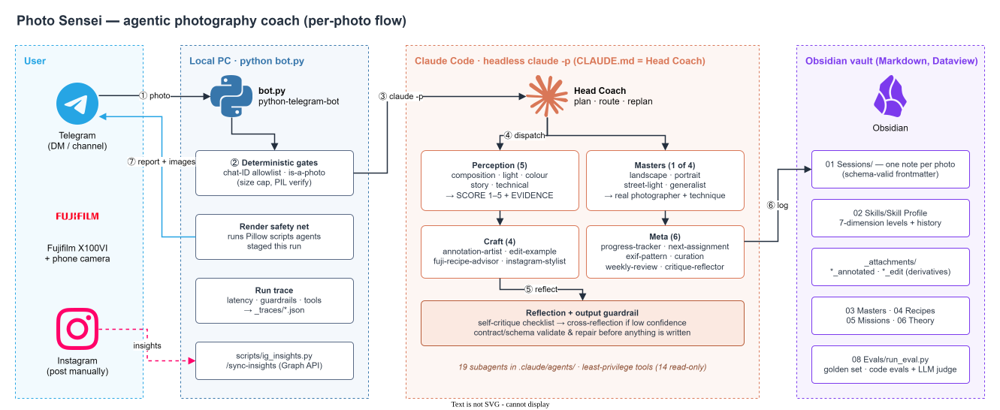

# 📸 Photo Sensei

**An agentic AI photography coach: send a photo on Telegram, and a team of Claude Code subagents critiques it, teaches through a real master photographer, draws the fixes on your frame, suggests a Fujifilm film-simulation recipe, and logs your progress in an Obsidian vault.**


[](LICENSE)



<sub>Editable source: [`docs/architecture.drawio`](docs/architecture.drawio) · PNG fallback: [`docs/architecture.png`](docs/architecture.png)</sub>

> **Repository status:** this repo currently holds the public design docs and diagram. The working
> vault (`bot.py`, `CLAUDE.md`, `.claude/agents/`, `08 Evals/`, `scripts/`) lives locally and has not
> been pushed yet. Personal content (photos, chat logs, session notes, traces) is gitignored and will
> never be published.

## Why this exists

Generic "rate my photo" chatbots give vague praise and forget you by the next message. Getting better
at photography takes specific, grounded feedback on *this* frame, a lineage to learn from, one
deliberate practice task at a time, and a record that shows whether you're actually improving. Photo
Sensei does that with a supervisor agent and specialist subagents, and puts guardrails at every step
so a single wrong read of the image doesn't carry through into the lesson, the edit and the trend.

## Highlights (engineering decisions)

- **Deterministic code for safety, the model for judgement.** File/size/decode checks, the chat
  allowlist, file paths and traces are plain Python in `bot.py`. Routing, critique and replanning are
  left to the model (`CLAUDE.md` §0). Any guarantee is enforced in code, not left to model output.
- **Defence in depth against cascading hallucination.** Each perception agent must return `EVIDENCE`
  (a region of the frame or an EXIF field) next to its `SCORE`. A mandatory self-critique pass runs
  before delivery, with a `critique-reflector` second opinion on low-confidence reads. The output
  guardrail checks each agent's contract block and repairs it before anything is written to the vault
  (`CLAUDE.md` §4b–4d, `99 Templates/Agent Contract.md`).
- **Structured state instead of chat history.** Agents share a typed `session` object (genre, evidence,
  scores, masters, annotations, mission, guardrails, trace), which `progress-tracker` writes to
  schema-valid YAML frontmatter. That keeps Dataview dashboards and the eval harness in sync
  (`99 Templates/Schemas.md`).
- **Least-privilege subagents.** 14 of the 19 agents in `.claude/agents/` can only `Read`. Only 3 can
  `Write` (annotation, edit, progress log) and 4 can use `Bash`. Writes only create new files: the
  original photo is never changed, and session history is append-only.
- **Cost-aware routing.** Only the agents a photo needs are dispatched. Exactly **one** of four
  "master" agents runs per photo (landscape / portrait / street-light / generalist), and the coach
  replans if `technical-analyst` flags a genre it misclassified.
- **Render safety net.** When run headless, the nested model sometimes writes a Pillow script but
  doesn't run it. `bot.py::_run_pending_render_scripts` runs only scripts created during *this* run,
  and `_latest_match` only picks up images for *this* photo's filename stem, so a user never gets a
  stale image from an earlier photo.
- **Observable and measurable.** Every photo writes a trace to `_traces/<stamp>.json` with a `.md`
  copy (per-stage latency, guardrail outcomes, tools used, return code). `08 Evals/run_eval.py` scores a
  10-item golden set with 6 code-based evaluators plus an LLM judge (actionability, grounding,
  diagnosis).
- **Prompt-injection hardening.** Text inside a photo or a forwarded message is treated as something to
  critique, never as a command (`bot.py::_build_photo_prompt`, `CLAUDE.md` §4c).

## How it works

1. **Photo in.** You DM the bot (or post in an allowlisted channel/group). `bot.py` downloads the
   highest-resolution version to `_attachments/` and logs it to the daily `00 Chat Log/`.
2. **Deterministic gates.** Checks the chat-ID allowlist (`AUTHORIZED_CHAT_IDS`), then the image
   itself: it exists, isn't empty, is ≤ 20 MB and passes `PIL.Image.verify()`. If it fails, you get a
   plain-language reply and a trace is written.
3. **Headless Claude Code.** `claude -p` runs in the vault directory, so `CLAUDE.md` loads as the
   **Head Coach** (orchestrator) with a configurable model and timeout.
4. **Plan & dispatch.** The coach classifies the photo and routes it to the perception analysts
   (composition, light, colour, story, technical) and one master agent that names a real photographer
   and a specific technique. The craft agents annotate the frame and make a teaching edit only if it
   helps explain the lesson. `fuji-recipe-advisor` suggests a film-simulation recipe.
5. **Reflect & validate.** A self-critique checklist runs (are the levers grounded? is the praise
   earned? is the lowest-scoring dimension coached first?), followed by contract/schema validation and
   repair.
6. **Log.** `progress-tracker` writes a session note and updates the 7-dimension Skill Profile.
   `next-assignment-coach` sets the next practice mission.
7. **Report back.** The bot sends the "Photo Coach Report", the annotated image and any teaching edit,
   then writes the run trace.

Text messages ("weekly review", "what are my habits", recipe questions) go to their own handlers
instead of the photo pipeline. A caption containing `/post` builds an Instagram post kit instead.

## Tech stack

| Layer | Tech |
|---|---|
| Interface | Telegram Bot API via `python-telegram-bot` (async, long polling) |
| Orchestration | Claude Code CLI, headless (`claude -p`); `CLAUDE.md` supervisor + 19 subagents in `.claude/agents/` |
| Image work | Pillow (annotation overlays, teaching edits, decode check), `exiftool` (EXIF mining) |
| Knowledge / state | Obsidian vault (Markdown + YAML frontmatter), Dataview dashboards |
| Evaluation | `08 Evals/run_eval.py`: golden CSV, code-based evaluators, LLM-as-judge |
| Feedback loop | `scripts/ig_insights.py`: Instagram Graph API v23.0 (insights only) |
| Runtime | Windows launcher (`Start Photo Sensei.bat`) with an auto-restart loop that kills any stale instance first, which avoids Telegram token conflicts |

## Getting started

**Prerequisites**
- **Claude Code** installed and signed in (run `claude` once). The bot calls `claude -p …`.
- **Python 3.10+**: `pip install python-telegram-bot pillow numpy pandas`
- **exiftool** on PATH (used by `exif-pattern-analyst`).
- **Obsidian** with the **Dataview** plugin (needed for the dashboard tables).

**Configure.** Copy `.env.example` to `.env` (gitignored; `.env` values override existing environment
variables):

```dotenv
TELEGRAM_BOT_TOKEN=            # from @BotFather /newbot (required)
AUTHORIZED_CHAT_IDS=           # comma-separated chat IDs; empty = open to anyone (not recommended)
PHOTO_SENSEI_MODEL=            # default claude-opus-4-8
PHOTO_SENSEI_TIMEOUT=          # seconds, default 1200 (the full pipeline takes several minutes)
PHOTO_SENSEI_PERMISSION_MODE=  # default bypassPermissions (see limitations)
PHOTO_SENSEI_OLLAMA_VISION=    # optional local vision model name, e.g. qwen2.5vl (logged only for now)
IG_ACCESS_TOKEN=               # optional, for /sync-insights
IG_USER_ID=                    # optional, for /sync-insights
```

Send `/id` to the bot in any chat to find the chat ID to put in the allowlist.

**Run**

```bash
python bot.py                  # or double-click "Start Photo Sensei.bat" on Windows
```

**Bot commands:** send a photo (critique), `/post [steer]` (Instagram post kit for the latest photo),
`/id`, `/start`. **Claude Code commands:** `/post [filename]`, `/sync-insights [--dry-run]`.

## Project structure

```
CLAUDE.md                 Head Coach: design principles, workflow, contracts, guardrails
bot.py                    Telegram bridge: gates, claude -p call, render safety net, traces
.claude/agents/           19 subagents (perception · masters · craft · meta)
.claude/commands/         /post, /sync-insights
scripts/ig_insights.py    Instagram insights -> session notes (append-only)
08 Evals/                 golden.csv, run_eval.py, results/
99 Templates/             Session & Mission templates, Agent Contract, Schemas
00 Dashboard.md           MOC with Dataview queries
02 Skills/ … 07 Gear/     Skill Profile, Masters, Recipes, Missions, Theory, Gear notes
01 Sessions/ _attachments/ _traces/ 00 Chat Log/   personal runtime data (gitignored)
docs/                     architecture diagram (draw.io source, SVG, PNG)
```

## Testing & quality

There's no unit-test suite. Quality is checked with an **eval harness** instead:

```bash
cd "08 Evals"
python run_eval.py --dry-run   # offline smoke test: all evaluators against a fixture, no model calls
python run_eval.py --limit 5   # run the real coach on the first 5 golden items
```

- **Golden set:** 10 photos in `golden.csv`, each with a planted issue, phrases the report must
  mention, a min/max score band per dimension, and the tool expected to fire.
- **Code evaluators:** report contract · exactly one real master + named technique · lowest dimension
  coached first · frontmatter schema-valid · referenced files exist · expected tool fired.
- **LLM-as-judge:** actionability, grounding, and whether the planted issue was diagnosed (1–5).
  Results are appended to `08 Evals/results/`. Run it before and after any change to `CLAUDE.md` or an
  agent.
- `python scripts/ig_insights.py --dry-run` previews the insights write-back from a fixture.

## Design decisions & limitations

- **`bypassPermissions` by default.** In headless `-p` mode nobody is there to approve Bash, so a
  stricter mode hangs on the Pillow step. As a result, the allowlist is the main security boundary.
  Set `AUTHORIZED_CHAT_IDS`, or switch to a stricter mode with a pre-approved allowlist in
  `.claude/settings.json`.
- **The render safety net runs scripts the model wrote.** It's limited to scripts created during the
  current run, but it's still model-generated code. A sandbox (a container, or a fixed render tool with
  typed parameters) would be the proper fix.
- **Photos are processed one at a time.** A full run takes minutes, and updates are handled in order
  (no job queue), so a second photo waits for the first to finish. `drop_pending_updates=False` means
  photos sent while the bot was restarting are still processed.
- **Traces are coarse.** `bot.py` records wall-clock and pipeline latency and infers tool use from
  output files. Per-agent spans and replan details (`from_genre`/`to_genre`) are placeholders for now.
- **The golden-set images aren't committed.** The eval runs offline in `--dry-run`, but a real run
  needs you to add your own photos to `08 Evals/golden/`.
- **Ollama vision fallback** can be configured but isn't wired into `run_claude` yet.
- **Instagram:** the Graph API is used only to read insights. Posting and picking music stay manual
  in the app, because no API can attach Instagram-library audio.

## Recipe sources & credit

Recipe **settings** are factual parameters, reproduced with attribution. Article text is **not**
copied. Recipes © **Fuji X Weekly / Ritchie Roesch** (`fujixweekly.com`); the Tri-X 400 recipe is by
**Anders Lindborg**. Please support the creators through the Fuji X Weekly app. `Classic Negative C7`
is the owner's own baseline recipe.

---

James Koh · [GitHub](https://github.com/gcjk768)
